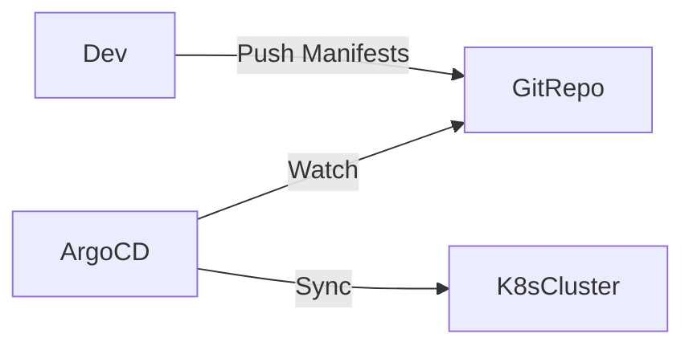

# Continuous Delivery Implementation

**Date:** 05 January 2025
**Lecture Topic:** GitOps with ArgoCD

## 1. What is GitOps?
Using a Git repository as the Single Source of Truth for infrastructure and application configuration.

## 2. ArgoCD
ArgoCD is a declarative, GitOps continuous delivery tool for Kubernetes.
- It monitors your running application (Cluster).
- It compares it with the Git repository (Manifests).
- It syncs changes if they drift.

**Visual Representation:**

## 3. Self-Healing
If you manually delete a deployment in the cluster, ArgoCD detects the difference and re-creates it automatically.
