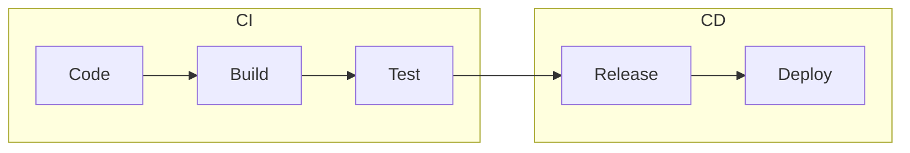

# Introduction to CI/CD

**Date:** 28 December 2024
**Lecture Topic:** Continuous Integration and Delivery

## 1. What is CI/CD?
- **CI (Continuous Integration):** Developers merge code changes into a central repository frequently. Automated builds and tests run.
- **CD (Continuous Delivery):** Code changes are automatically prepared for a release to production.
- **CD (Continuous Deployment):** Every change that passes all stages of your production pipeline is released to your customers automatically.

**Visual Representation:**

## 2. Benefits
- Smaller code changes.
- Faster isolation of faults.
- Faster MTTR (Mean Time To Resolution).
