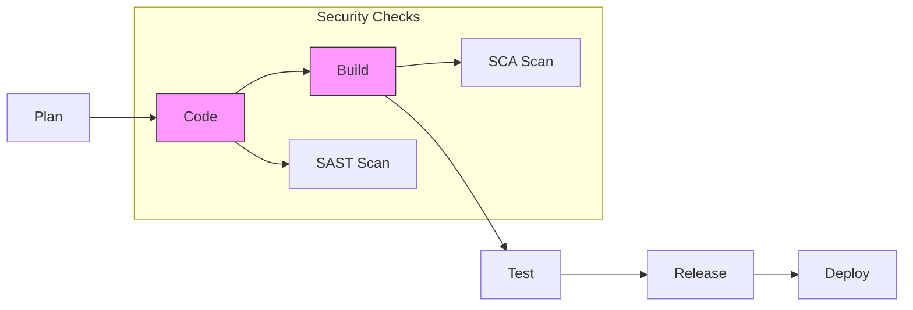

# Introduction to DevSecOps

**Date:** 04 January 2025
**Lecture Topic:** Security in DevOps

## 1. What is DevSecOps?
It stands for Development, Security, and Operations. It means integrating security practices into the DevOps process from the start (Shift Left).

## 2. Shift Left Security
Traditionally, security was checked at the end.
**Shift Left:** Testing for security flaws early in the SDLC.

**Visual Representation:**

## 3. Tools
- **SAST (Static Application Security Testing):** SonarQube.
- **SCA (Software Composition Analysis):** Snyk (Checks dependencies).
- **DAST (Dynamic Application Security Testing):** OWASP ZAP.
