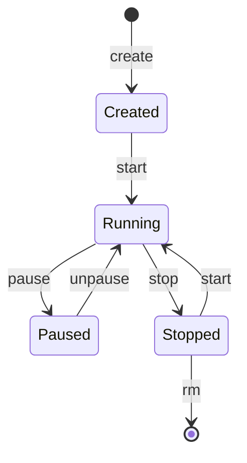

# Docker Containers

**Date:** 24 November 2024
**Lecture Topic:** Managing Containers

## 1. The Container Lifecycle
A container is a running instance of an image.
- **Create:** `docker create`
- **Start:** `docker start`
- **Run:** (Create + Start) `docker run`
- **Stop:** `docker stop` (Graceful shutdown)
- **Kill:** `docker kill` (Force shutdown)
- **Remove:** `docker rm`

**Visual Representation:**

## 2. Networking
Containers need to talk.
- **Bridge Network:** Default. Containers on same bridge can talk.
- **Host Network:** Container shares host's network stack.
- **None:** No networking.

### Port Mapping
`docker run -p 8080:80 nginx`
- Maps host port 8080 to container port 80.

## 3. Interactive vs Detached
- **Detached (`-d`):** Run in background.
- **Interactive (`-it`):** Attach terminal.
  - `docker exec -it <container_id> /bin/bash` (Enter running container).
