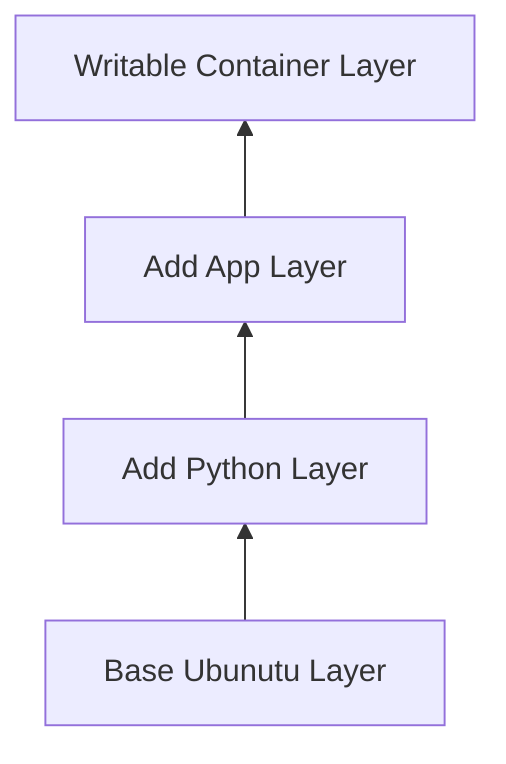

# Docker Images

**Date:** 17 November 2024
**Lecture Topic:** Understanding Docker Images

## 1. What is an Image?
A Docker image is a read-only template with instructions for creating a Docker container. It contains the code, runtime, libraries, environment variables, and config files.

## 2. Layered Architecture
Docker images are built up from a series of layers. Each layer represents an instruction in the image's Dockerfile.

**Visual Representation:**

When you change the Dockerfile and rebuild, only the changed layers are rebuilt (caching).

## 3. Basic Commands
- `docker images`: List locally stored images.
- `docker pull <image>`: Download image from registry.
- `docker rmi <image>`: Remove an image.
- `docker history <image>`: Show layers.
