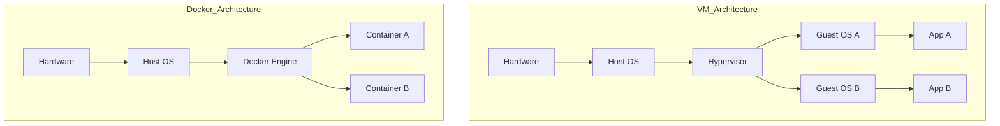

# Introduction to Docker

**Date:** 16 November 2024
**Lecture Topic:** Docker Basics

## 1. What is Docker?
Docker is an open platform for developing, shipping, and running applications. It enables you to separate your applications from your infrastructure so you can deliver software quickly.

## 2. Containers vs. Virtual Machines

| Feature | Virtual Machines | Containers |
| :--- | :--- | :--- |
| **Guest OS** | Complete OS per VM | Shared Host OS Kernel |
| **Isolation** | Hardware-level | Operating System-level |
| **Size** | Gigabytes | Megabytes |
| **Boot up** | Minutes | Seconds |

**Visual Representation:**

## 3. Docker Architecture
- **Client:** The `docker` CLI.
- **Daemon:** The background process (`dockerd`) that manages containers.
- **Registry:** Stores Docker images (e.g., Docker Hub).
