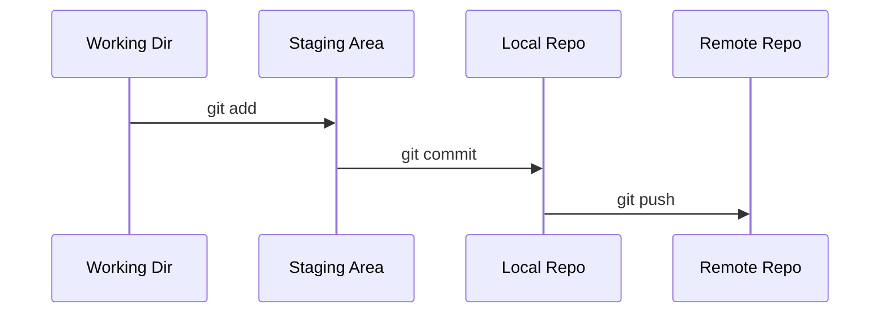

# Git Refresher

**Date:** 10 November 2024
**Lecture Topic:** Git Version Control

## 1. Core Concepts
- **Repository:** The project folder.
- **Commit:** A snapshot of change.
- **Branch:** A parallel version of the project.

## 2. Git Flow

## 3. Branching Strategies

### Basic Branching
- `git branch feature-x`: Create branch.
- `git checkout feature-x`: Switch to branch.
- `git merge feature-x`: Merge changes back to main.

### Merge Conflicts
Occur when two branches modify the same line.
- Resolve manually in the file.
- `git add <file>` marks it as resolved.

## 4. Rebase vs Merge
- **Merge:** Preserves history, creates a merge commit.
- **Rebase:** Rewrites history, linearizes commits.
> [!WARNING]
> Never rebase public branches!

## 5. Stashing
Temporarily save changes without committing.
- `git stash`
- `git stash pop`
