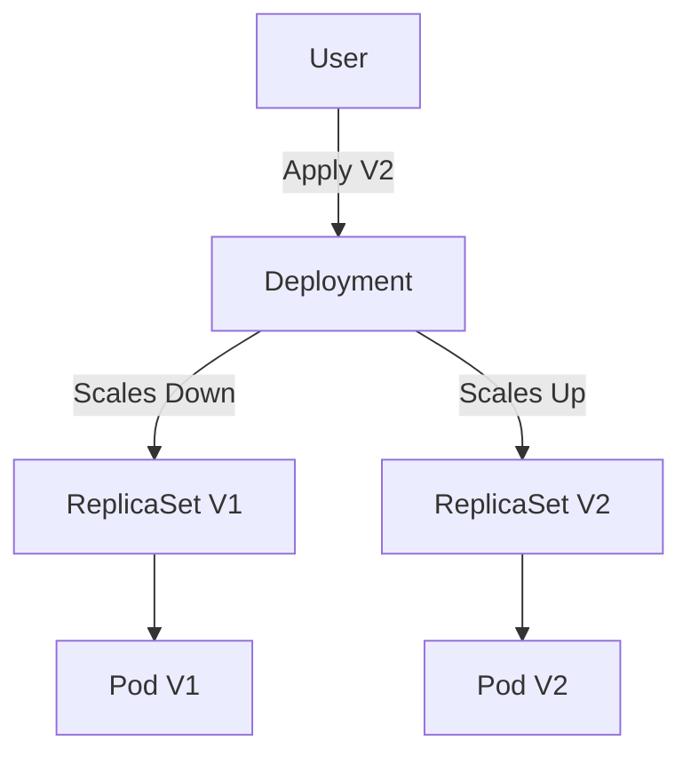

# Deep Dive into Kubernetes Deployments

**Date:** 14 December 2024
**Lecture Topic:** Deployments & Rollouts

## 1. What is a Deployment?
A Deployment provides declarative updates for Pods and ReplicaSets.
- It manages the ReplicaSet.
- It allows for rolling updates and rollbacks.

## 2. Rolling Updates
By default, Deployment updates pods in a rolling fashion (e.g., 25% unavailable, 25% surge).

**Strategy:**
```yaml
strategy:
  type: RollingUpdate
  rollingUpdate:
    maxUnavailable: 1
    maxSurge: 1
```

## 3. Rollbacks
If a deployment fails, you can rollback to a previous revision.
`kubectl rollout undo deployment/nginx-deployment`

**Visual Representation:**

