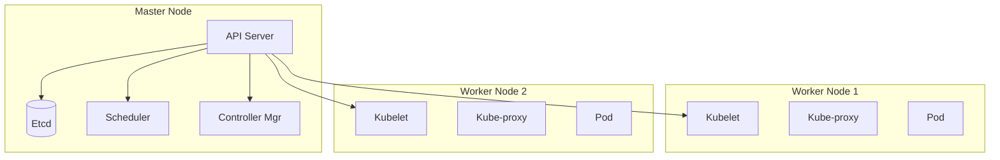

# Introduction to Orchestration using Kubernetes

**Date:** 01 December 2024
**Lecture Topic:** Kubernetes Architecture

## 1. What is Orchestration?
Managing hundreds of containers manually is impossible. Orchestration automates:
- Provisioning and deployment
- Scaling
- Health monitoring
- Load balancing

## 2. Kubernetes Architecture
Kubernetes (K8s) follows a Master-Worker architecture.

### Control Plane (Master Node)
Responsible for maintaining the desired state.
- **API Server:** The entry point (REST).
- **Etcd:** Key-value store for cluster data (Source of Truth).
- **Scheduler:** Decides where to run pods.
- **Controller Manager:** Detects state changes.

### Worker Node
Runs the applications.
- **Kubelet:** Agent that talks to API Server.
- **Kube-proxy:** Handles networking.
- **Container Runtime:** Docker/Containerd.

**Visual Representation:**

