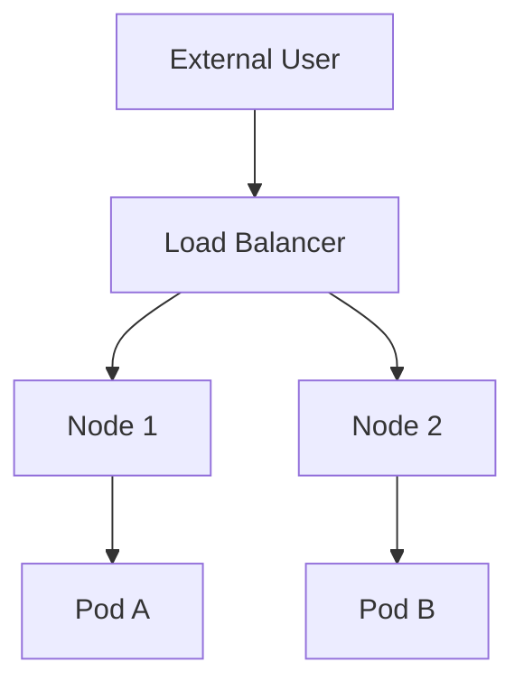

# Understanding Kubernetes Services

**Date:** 15 December 2024
**Lecture Topic:** Service Types

## 1. Why Services?
Pods are ephemeral given IP addresses. When they die and restart, IP changes. Services provide a stable IP and DNS name.

## 2. Service Types

### ClusterIP (Default)
Exposes service on an internal IP. Only reachable from within the cluster.

### NodePort
Exposes service on each Node's IP at a static port (30000-32767).
- Access: `<NodeIP>:<NodePort>`

### LoadBalancer
Exposes service externally using a cloud provider's load balancer (AWS ELB, Google LB).

**Visual Representation:**

