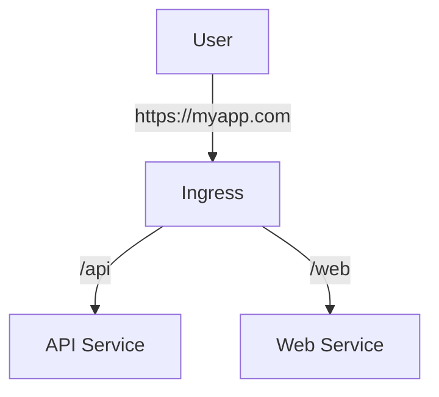

# Deep Dive into Kubernetes Services

**Date:** 21 December 2024
**Lecture Topic:** DNS & Ingress

## 1. Service Discovery (DNS)
Kube-DNS / CoreDNS runs as a service.
Every Service gets a DNS name:
`my-svc.my-namespace.svc.cluster.local`

## 2. Ingress
Services (NodePort/LoadBalancer) operate at Layer 4 (TCP/UDP). Ingress operates at Layer 7 (HTTP/HTTPS).
- Allows path-based routing (`/api`, `/web`).
- TLS Termination.

**Visual Representation:**

