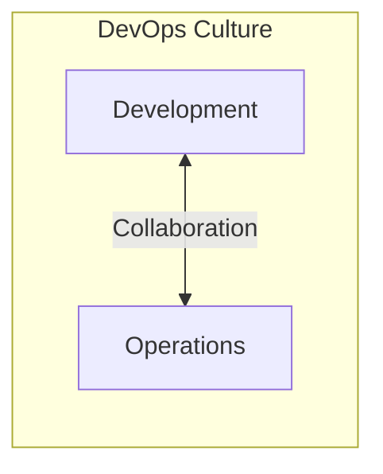
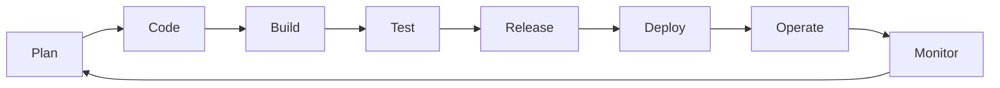

# DevOps Introduction

**Date:** 02 November 2024
**Lecture Topic:** DevOps Introduction

## 1. What is DevOps?
DevOps is a set of practices that works to automate and integrate the processes between software development and IT teams, so they can build, test, and release software faster and more reliably.

### The CAMS Model
The core values of DevOps can be summarized by CAMS:
- **Culture:** People > Tools. Shared responsibility.
- **Automation:** Removing manual toil.
- **Measurement:** Data-driven decisions.
- **Sharing:** Feedback loops.

**Visual Representation:**

## 2. SDLC Evolution

### Waterfall
Sequential phases.
- **Reqs -> Design -> Code -> Test -> Deploy**
- **Issues:** High risk, late feedback.

### Agile
Iterative development.
- **Sprints:** 2-4 weeks.
- **Issues:** Only fixed Dev speed; Ops was still a bottleneck ("The Wall of Confusion").

### DevOps
Continuous Integration & Continuous Delivery (CI/CD).
- **Infinite Loop:** Plan -> Code -> Build -> Test -> Release -> Deploy -> Operate -> Monitor.

**Visual Representation:**

## 3. DevOps Tools Ecosystem
- **Version Control:** Git
- **CI:** Jenkins, Github Actions
- **Containerization:** Docker
- **Orchestration:** Kubernetes
- **IaC:** Terraform
- **Monitoring:** Prometheus, Grafana
