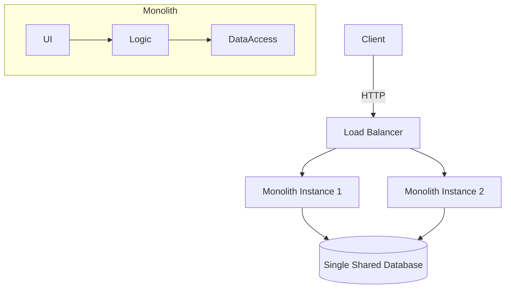
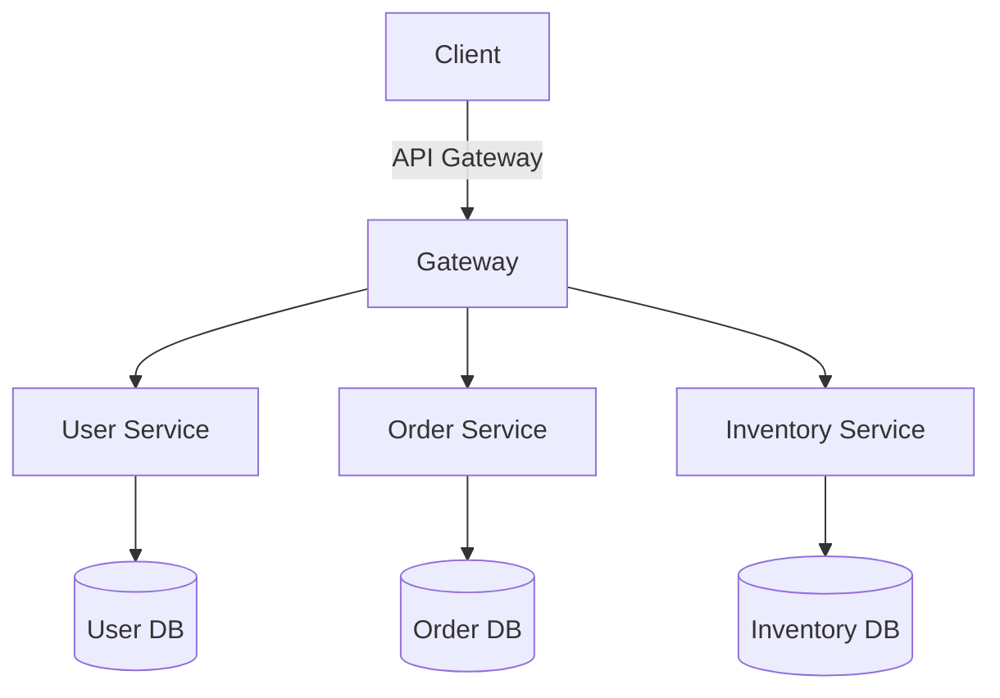

# Microservices Introduction

**Date:** 27 October 2024
**Lecture Topic:** Microservices Architecture

## 1. Evolution of Software Architecture

### Monolithic Architecture
Traditionally, applications were built as **Monoliths**. A single executable file contained all the modules:
- UI Layer
- Business Logic Layer
- Data Access Layer

**Visual Representation:**

**Challenges with Monoliths:**
1.  **Tight Coupling:** Changes in one module can impact unrelated modules.
2.  **Scalability:** You must scale the *entire* application even if only one module (e.g., Search) is under load.
3.  **Tech Stack Lock-in:** Hard to migrate to newer technologies.
4.  **Deployment Friction:** High risk; requires downtime (often).

### Microservices Architecture
Microservices break the application into small, independent services, each running in its own process.

**Visual Representation:**

**Key Characteristics:**
- **Single Responsibility:** Each service does *one* thing well.
- **Independence:** Deployable and scalable independently.
- **Decentralized Data:** Database-per-service pattern.
- **Polyglot:** Services can be written in Python, Go, Java, etc.

## 2. Communication Protocols
Microservices need to talk to each other.

### Synchronous (REST / gRPC)
- **Direct call:** Service A calls Service B and waits.
- **Pros:** Simple to understand.
- **Cons:** Coupling; if Service B is down, Service A might fail (Cascading failure).

### Asynchronous (Message Brokers)
- **Event-driven:** Service A publishes an event to a queue (RabbitMQ, Kafka); Service B consumes it.
- **Pros:** Decoupled; Service A doesn't care if Service B is online immediately.
- **Cons:** Complexity in tracking flows.

## 3. Advantages & Disadvantages

| Feature | Monolith | Microservices |
| :--- | :--- | :--- |
| **Development** | Single codebase, easier initially | Complex distributed system |
| **Deployment** | "Big Bang" deployments | Rolling updates, Canary releases |
| **Fault Tolerance** | Single bug can crash app | Failure isolated to one service |
| **Scalability** | Horizontal scaling of full app | Fine-grained scaling |

## 4. When to use Microservices?
- Large, complex domains.
- Teams need to move independently.
- High scalability requirements.
- **Don't start with Microservices!** (Start with a Modular Monolith).
