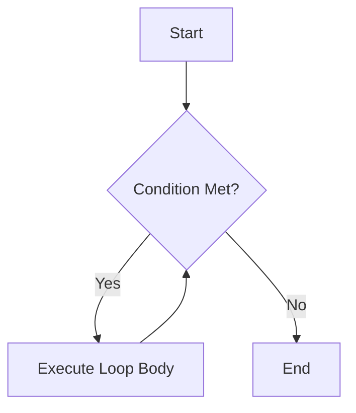

# Introduction to Shell Scripting

**Date:** 09 November 2024
**Lecture Topic:** Shell Scripting basics

## 1. What is a Shell Script?
A shell script is a program designed to be run by the Unix shell, a command-line interpreter.

### Shebang
Every script starts with a "shebang" line:
```bash
#!/bin/bash
```
This tells the system which interpreter to use.

## 2. Variables & Comments
```bash
# This is a comment
NAME="DevOps"
echo "Hello, $NAME"
```

## 3. Control Flow

### If-Else
```bash
if [ -f "file.txt" ]; then
    echo "File exists"
else
    echo "File not found"
fi
```

### Loops


#### For Loop
```bash
for i in {1..5}; do
    echo "Iteration $i"
done
```

## 4. Crontab (Scheduling)
Used to schedule periodic tasks.
- Format: `* * * * * command_to_execute`

| Field | Range |
| :--- | :--- |
| Minute | 0-59 |
| Hour | 0-23 |
| Day of Month | 1-31 |
| Month | 1-12 |
| Day of Week | 0-7 |

Example: Run backup every day at 2 AM.
`0 2 * * * /scripts/backup.sh`
