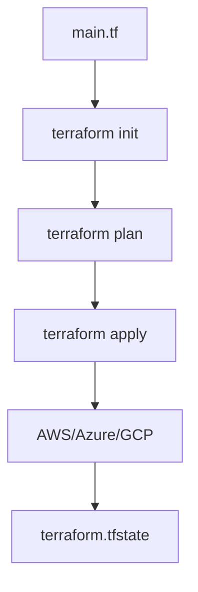

# Introduction to Terraform and Infrastructure Provisioning

**Date:** 11 January 2025
**Lecture Topic:** Infrastructure as Code (IaC)

## 1. What is IaC?
Managing infrastructure (servers, networks, load balancers) using code and version control systems, rather than manual processes.

## 2. Terraform
Terraform is an open-source tool by HashiCorp to provision infrastructure.
- **Provider Agnostic:** AWS, Azure, GCP, Docker, Kubernetes.
- **Declarative:** You define the "What", Terraform figures out the "How".

## 3. Terraform Lifecycle
1.  **Init:** Initialize the working directory.
2.  **Plan:** Create an execution plan (Dry Run).
3.  **Apply:** Execute the changes.
4.  **Destroy:** Destroy the infrastructure.

**Visual Representation:**

